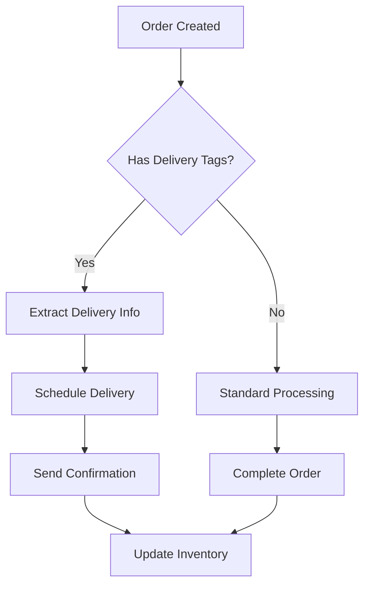

# Shopify Webhook Integration Guide

This guide covers the comprehensive Shopify webhook integration for the Delivery Scheduler application, ensuring real-time synchronization between your Shopify store and delivery scheduling system.

## 🎯 Overview

The Shopify webhook integration provides real-time notifications for all critical events in your store, enabling automatic delivery scheduling, inventory management, and order processing.

## 📋 Supported Webhook Topics

### Order Lifecycle (Critical for Delivery Scheduling)

| Topic | Description | Importance | Use Case |
|-------|-------------|------------|----------|
| `orders/create` | New orders created | Critical | Initialize delivery scheduling |
| `orders/updated` | Orders modified | Critical | Update delivery details |
| `orders/cancelled` | Orders cancelled | High | Cancel scheduled deliveries |
| `orders/fulfilled` | Orders fulfilled | High | Mark deliveries as completed |
| `orders/partially_fulfilled` | Partial fulfillment | Medium | Update delivery schedule |
| `orders/paid` | Payment confirmed | High | Confirm delivery after payment |

### Product Management

| Topic | Description | Importance | Use Case |
|-------|-------------|------------|----------|
| `products/create` | New products added | Medium | Enable delivery scheduling |
| `products/update` | Products modified | Medium | Update delivery settings |
| `products/delete` | Products removed | Medium | Clean up delivery data |
| `inventory_levels/update` | Stock levels changed | High | Update delivery availability |

### Customer Management

| Topic | Description | Importance | Use Case |
|-------|-------------|------------|----------|
| `customers/create` | New customers | Medium | Set delivery preferences |
| `customers/update` | Customer info updated | Medium | Update delivery settings |
| `customers/delete` | Customers removed | Low | Clean up customer data |

### Fulfillment & Shipping

| Topic | Description | Importance | Use Case |
|-------|-------------|------------|----------|
| `fulfillments/create` | Fulfillments created | High | Track delivery status |
| `fulfillments/update` | Fulfillments updated | High | Update delivery tracking |
| `shipping_addresses/update` | Addresses changed | Medium | Recalculate delivery zones |

### Cart Events

| Topic | Description | Importance | Use Case |
|-------|-------------|------------|----------|
| `carts/create` | Shopping carts created | Medium | Prepare delivery options |
| `carts/update` | Carts modified | Medium | Update delivery availability |

### App Lifecycle

| Topic | Description | Importance | Use Case |
|-------|-------------|------------|----------|
| `app/uninstalled` | App removed from store | Critical | Clean up all data |
| `app/subscriptions/update` | Subscription changes | High | Adjust features |

## 🚀 Setup Instructions

### Step 1: Configure Shopify App

1. **Create a Private App** (if using private app approach):
   ```bash
   # Go to Shopify Admin > Apps > Develop apps > Create an app
   # Enable required permissions:
   # - read_products, write_products
   # - read_orders, write_orders
   # - read_customers, write_customers
   # - read_inventory, write_inventory
   ```

2. **Get Required Credentials**:
   - **Shop Domain**: `your-store.myshopify.com`
   - **Access Token**: `shpat_xxxxxxxxxxxxxxxxxxxxxxxxxxxxxxxx`
   - **App Secret**: For webhook verification

### Step 2: Configure Delivery Scheduler

1. **Navigate to Settings**:
   ```
   Admin Dashboard > Settings > Shopify Integration
   ```

2. **Enter Credentials**:
   - Shop Domain: `your-store.myshopify.com`
   - Access Token: Your private app access token
   - App Secret: Your app secret for webhook verification
   - API Version: `2024-01` (recommended)

3. **Test Connection**:
   - Click "Test Connection" to verify credentials
   - Ensure all required permissions are granted

### Step 3: Register Webhooks

1. **Go to Webhook Management**:
   ```
   Admin Dashboard > Settings > Webhooks
   ```

2. **Register All Webhooks**:
   - Click "Register All Webhooks"
   - Review registration results
   - Verify all critical webhooks are registered

3. **Verify Webhook Status**:
   - Check that all webhooks show "Registered" status
   - Monitor webhook delivery in Shopify admin

## 🔧 Webhook Processing

### Order Processing Flow



### Delivery Tag System

The system uses Shopify order tags to track delivery scheduling:

- `delivery-scheduled`: Order has scheduled delivery
- `collection-scheduled`: Order has scheduled collection
- `delivery-date:YYYY-MM-DD`: Scheduled delivery date
- `delivery-time:HH:MM`: Scheduled delivery time
- `delivery-confirmed`: Delivery confirmed by customer
- `delivery-cancelled`: Delivery cancelled

### Example Order Tags

```json
{
  "tags": "delivery-scheduled, delivery-date:2024-01-15, delivery-time:14:00"
}
```

## 🛡️ Security Features

### HMAC Signature Verification

All webhooks are verified using Shopify's HMAC signature:

```javascript
const generatedHmac = crypto
  .createHmac('sha256', appSecret)
  .update(body, 'utf8')
  .digest('base64');

if (generatedHmac !== hmacHeader) {
  // Reject webhook
}
```

### User-Specific Credentials

- Each user has their own Shopify credentials
- Webhooks are processed in user context
- No cross-user data access

### Error Handling

- Failed webhooks are logged but don't break the system
- Shopify automatically retries failed webhooks
- Comprehensive error logging for debugging

## 📊 Monitoring & Debugging

### Webhook Status Dashboard

The admin dashboard provides:

- **Registration Status**: View all registered webhooks
- **Importance Levels**: Critical, High, Medium, Low
- **Category Grouping**: Orders, Products, Customers, etc.
- **Real-time Updates**: Live status of webhook registration

### Logging

All webhook events are logged with:

```javascript
console.log(`🔔 Shopify Webhook processed for user ${userId}:`, {
  topic: topicHeader,
  webhookId: webhookIdHeader,
  apiVersion: apiVersionHeader,
  eventId: event.id
});
```

### Common Issues

1. **Webhook Not Receiving**:
   - Check webhook URL is accessible
   - Verify HMAC signature verification
   - Ensure app has required permissions

2. **Duplicate Webhooks**:
   - System automatically detects and updates existing webhooks
   - No duplicate registration occurs

3. **Permission Errors**:
   - Verify app has all required scopes
   - Check access token is valid
   - Ensure API version is supported

## 🔄 Webhook Retry Logic

Shopify automatically retries failed webhooks:

- **Retry Schedule**: 5 minutes, 15 minutes, 1 hour, 4 hours, 24 hours
- **Max Retries**: 19 attempts over 24 hours
- **Success Response**: Always return HTTP 200

## 📈 Performance Considerations

### Webhook Processing

- **Async Processing**: All webhook handlers are asynchronous
- **Non-blocking**: Webhook processing doesn't block other operations
- **Error Isolation**: Individual webhook failures don't affect others

### Rate Limiting

- **Shopify Limits**: 2 webhooks per second per shop
- **Automatic Throttling**: Built-in rate limiting
- **Queue Management**: Proper queuing for high-volume shops

## 🎯 Best Practices

### 1. Webhook Registration

- Register all webhooks during initial setup
- Use the "Register All Webhooks" button for consistency
- Monitor registration results for any failures

### 2. Error Handling

- Always return HTTP 200 to acknowledge webhooks
- Log errors but don't throw exceptions
- Implement proper error recovery mechanisms

### 3. Security

- Never log sensitive data (access tokens, customer info)
- Always verify HMAC signatures
- Use HTTPS for all webhook endpoints

### 4. Monitoring

- Regularly check webhook registration status
- Monitor webhook delivery in Shopify admin
- Set up alerts for webhook failures

### 5. Testing

- Test webhook processing with sample data
- Verify delivery scheduling integration
- Test error scenarios and recovery

## 🔗 Integration Points

### Delivery Scheduling

Webhooks automatically trigger:

- **Order Creation**: Initialize delivery scheduling
- **Order Updates**: Update delivery details
- **Order Cancellation**: Cancel scheduled deliveries
- **Payment Confirmation**: Confirm delivery scheduling

### Inventory Management

- **Product Updates**: Sync delivery availability
- **Inventory Changes**: Update delivery capacity
- **Stock Levels**: Adjust delivery scheduling

### Customer Management

- **Customer Creation**: Set default delivery preferences
- **Customer Updates**: Update delivery settings
- **Address Changes**: Recalculate delivery zones

## 📞 Support

### Troubleshooting

1. **Check Webhook Status**: Admin Dashboard > Settings > Webhooks
2. **Review Logs**: Check server logs for webhook processing
3. **Verify Credentials**: Test Shopify connection
4. **Check Permissions**: Ensure app has required scopes

### Common Solutions

- **Webhook Not Working**: Re-register webhooks
- **Permission Errors**: Update app permissions
- **Signature Failures**: Verify app secret
- **Connection Issues**: Check shop domain and access token

---

**Need Help?** Check the main documentation or contact support for assistance with webhook integration. 